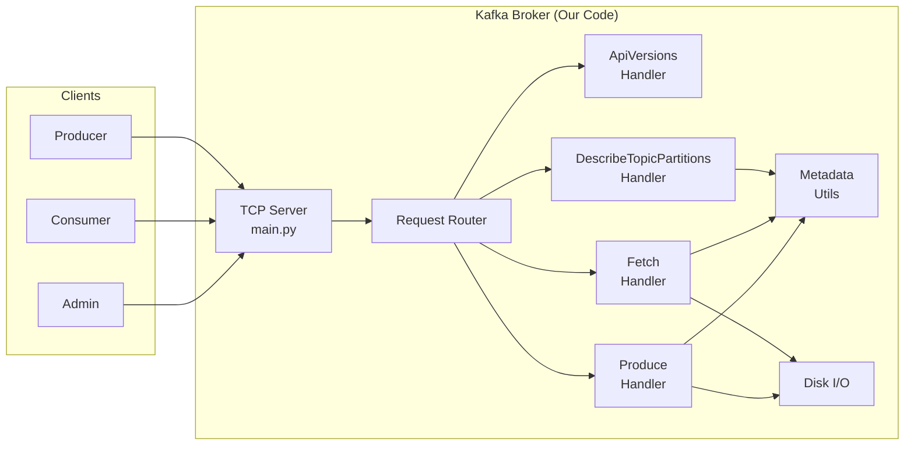
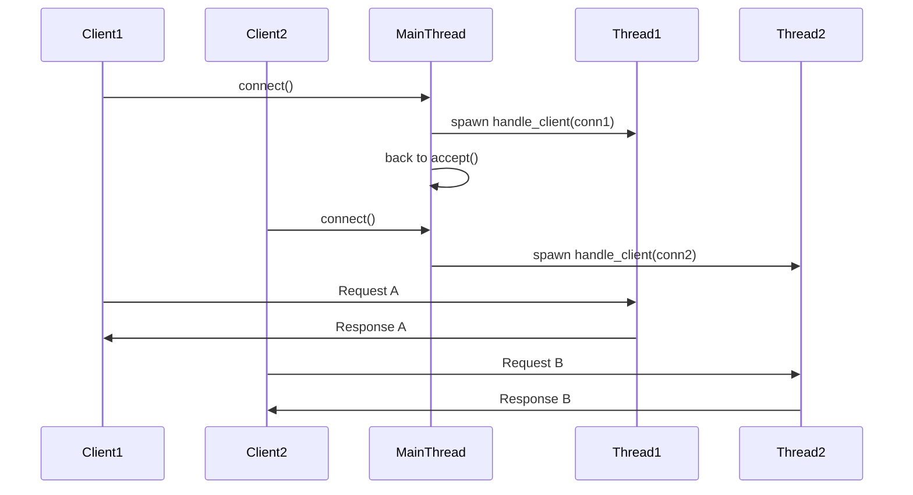
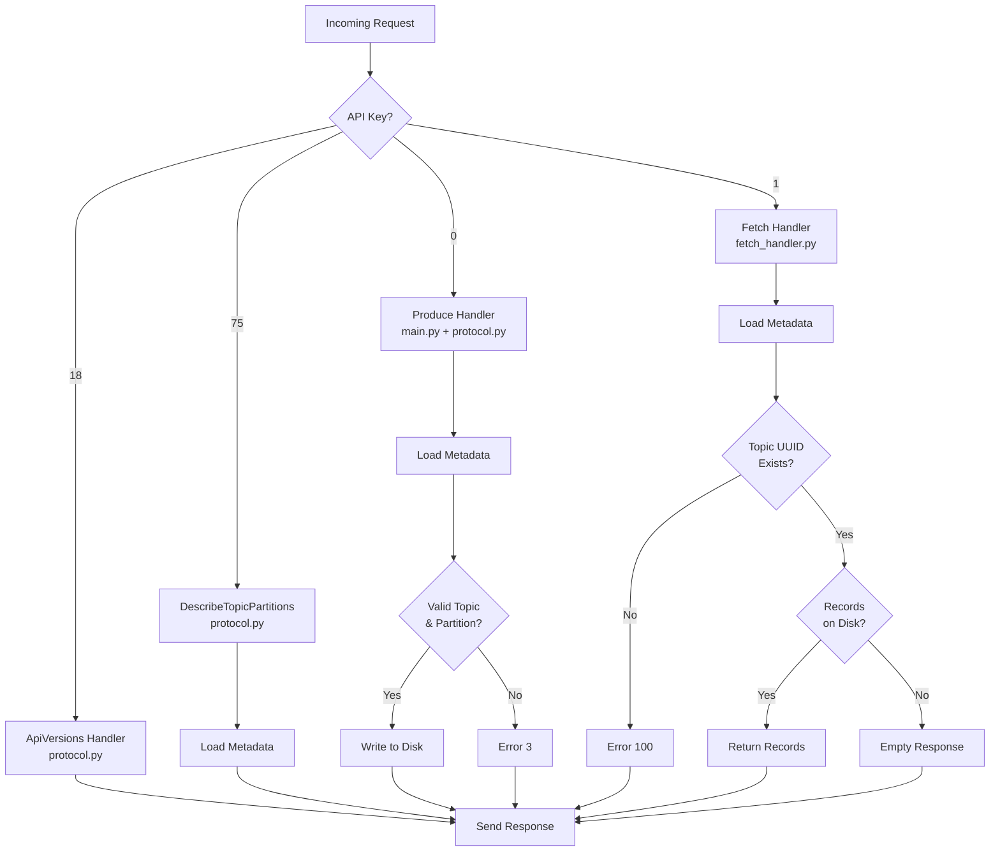

# 📖 Building a Kafka Broker from Scratch — A Complete Learning Guide

> *From raw TCP bytes to a fully functioning message broker, one stage at a time.*

This guide documents the **iterative, ground-up construction** of a Kafka-compatible message broker in Python. Every section mirrors a real implementation stage — introducing the concept first, then walking through the precise code logic that brings it to life.

---

## Table of Contents

- [Prologue: Architecture Overview](#prologue-architecture-overview)
- **Part I — Foundations**
  - [Stage 1: Bind to a Port](#stage-1-bind-to-a-port)
  - [Stage 2: Send Correlation ID](#stage-2-send-correlation-id)
  - [Stage 3: Parse Correlation ID](#stage-3-parse-correlation-id)
  - [Stage 4: Parse API Version](#stage-4-parse-api-version)
  - [Stage 5: Handle ApiVersions Requests](#stage-5-handle-apiversions-requests)
- **Part II — Concurrency**
  - [Stage 6: Serial Requests](#stage-6-serial-requests)
  - [Stage 7: Concurrent Requests](#stage-7-concurrent-requests)
- **Part III — Listing Partitions**
  - [Stage 8: Include DescribeTopicPartitions in ApiVersions](#stage-8-include-describetopicpartitions-in-apiversions)
  - [Stage 9: List for an Unknown Topic](#stage-9-list-for-an-unknown-topic)
  - [Stage 10: List for a Single Partition](#stage-10-list-for-a-single-partition)
  - [Stage 11: List for Multiple Partitions](#stage-11-list-for-multiple-partitions)
  - [Stage 12: List for Multiple Topics](#stage-12-list-for-multiple-topics)
- **Part IV — Consuming Messages**
  - [Stage 13: Include Fetch in ApiVersions](#stage-13-include-fetch-in-apiversions)
  - [Stage 14: Fetch with No Topics](#stage-14-fetch-with-no-topics)
  - [Stage 15: Fetch with an Unknown Topic](#stage-15-fetch-with-an-unknown-topic)
  - [Stage 16: Fetch with an Empty Topic](#stage-16-fetch-with-an-empty-topic)
  - [Stage 17: Fetch Single Message from Disk](#stage-17-fetch-single-message-from-disk)
  - [Stage 18: Fetch Multiple Messages from Disk](#stage-18-fetch-multiple-messages-from-disk)
- **Part V — Producing Messages**
  - [Stage 19: Include Produce in ApiVersions](#stage-19-include-produce-in-apiversions)
  - [Stage 20: Respond for Invalid Topic or Partition](#stage-20-respond-for-invalid-topic-or-partition)
  - [Stage 21: Respond for Valid Topic and Partition](#stage-21-respond-for-valid-topic-and-partition)
  - [Stage 22: Produce a Single Record](#stage-22-produce-a-single-record)
  - [Stage 23: Produce Multiple Records](#stage-23-produce-multiple-records)
  - [Stage 24: Produce to Multiple Partitions](#stage-24-produce-to-multiple-partitions)
  - [Stage 25: Produce to Multiple Partitions of Multiple Topics](#stage-25-produce-to-multiple-partitions-of-multiple-topics)
- [Epilogue: Final Architecture](#epilogue-final-architecture)

---

## Prologue: Architecture Overview

Before diving into individual stages, let's understand the shape of the system we're building. A Kafka broker is, at its core, a **TCP server** that speaks a specific **binary protocol**. Clients connect over a raw socket, send requests as carefully formatted byte sequences, and receive binary responses.

### The Big Picture



### File Layout

| File | Responsibility |
|------|---------------|
| `app/main.py` | TCP server, request routing, client handler loop |
| `app/parsing.py` | Binary deserialization of all request types |
| `app/protocol.py` | Response serialization for ApiVersions, DescribeTopicPartitions, Produce |
| `app/fetch_handler.py` | Response serialization for all Fetch response variants |
| `app/metadata_utils.py` | KRaft metadata log scanning (topic discovery, partition extraction) |

### The Kafka Binary Protocol — A 30-Second Primer

Every Kafka message over the wire follows this structure:

```
┌──────────────┬──────────────────────────────────────┐
│ message_size │              payload                 │
│   (4 bytes)  │  (header + body, `message_size` bytes) │
└──────────────┴──────────────────────────────────────┘
```

The **header** always starts with:

```
┌──────────┬─────────────┬────────────────┬───────────────┐
│ api_key  │ api_version │ correlation_id │  client_id    │
│ (2 bytes)│  (2 bytes)  │   (4 bytes)    │ (variable)    │
└──────────┴─────────────┴────────────────┴───────────────┘
```

This is the rosetta stone of every stage that follows. Every request we'll parse starts at byte offset 0 with `message_size`, followed by this header.

---

# Part I — Foundations

> *In these stages, we build the TCP server, learn to echo back correlation IDs, validate API versions, and respond to `ApiVersions` requests. This is the skeleton on which everything else hangs.*

---

## Stage 1: Bind to a Port

### 🧠 The Concept

A Kafka broker is a network service. Before it can process any messages, it must **bind to a TCP port** and listen for incoming connections. In production Kafka, this defaults to port `9092`.

At this stage, we don't need to understand the Kafka protocol at all. We just need to:
1. Create a TCP socket
2. Bind it to `localhost:9092`
3. Start accepting connections

### 🔧 The Code Logic

```python
import socket

def main():
    server = socket.create_server(
        ("localhost", 9092),
        reuse_port=True,
    )
    conn, addr = server.accept()  # Block until a client connects
```

**Key details:**

| Parameter | Purpose |
|-----------|---------|
| `"localhost"` | Bind to the loopback interface only |
| `9092` | Kafka's standard port |
| `reuse_port=True` | Allow rapid restarts without `Address already in use` errors |

> [!NOTE]
> `socket.create_server()` is a Python 3.8+ convenience that wraps `socket()`, `bind()`, `listen()`, and `setsockopt()` into a single call. Under the hood, it creates an `AF_INET, SOCK_STREAM` socket with `SO_REUSEADDR`.

At this point, our broker does nothing with the connection — it just accepts it. The tester simply verifies that it can successfully establish a TCP connection to port 9092.

---

## Stage 2: Send Correlation ID

### 🧠 The Concept

Every Kafka request contains a **correlation ID** — a 4-byte integer chosen by the client. The broker must echo this same ID back in its response. This is how clients match responses to their in-flight requests when multiplexing.

```
Request:  ... [correlation_id = 0x00000007] ...
Response: [message_size] [correlation_id = 0x00000007] ...
```

At this stage, we don't even need to parse the request fully. We just need to:
1. Read raw bytes from the socket
2. Extract bytes 8–12 (the correlation ID)
3. Send back a response containing just the size + correlation ID

### 🔧 The Code Logic

```python
request = conn.recv(1024)

# The correlation_id lives at bytes 8-12 in every Kafka request
# Bytes 0-3: message_size
# Bytes 4-5: api_key
# Bytes 6-7: api_version
# Bytes 8-11: correlation_id
correlation_id = request[8:12]

# Response = [4-byte message_size] + [4-byte correlation_id]
response_body = correlation_id
message_size = len(response_body)
response = message_size.to_bytes(4, "big") + response_body
conn.sendall(response)
```

**Byte map of a minimal response:**

```
Offset  0  1  2  3  │  4  5  6  7
        ──────────── │ ────────────
        message_size │ correlation_id
        00 00 00 04  │ XX XX XX XX
```

> [!IMPORTANT]
> All Kafka integers are **big-endian** (network byte order). Python's `int.from_bytes(data, "big")` and `int.to_bytes(n, "big")` handle this naturally. This convention is used throughout the entire protocol.

---

## Stage 3: Parse Correlation ID

### 🧠 The Concept

This stage reinforces the previous one with a twist: the tester sends **multiple requests** with different correlation IDs, and we must echo each one correctly. This forces us to implement a **read loop** — continuously reading from the socket until the client disconnects.

### 🔧 The Code Logic

```python
while True:
    request = conn.recv(1024)
    if not request:
        break  # Client disconnected

    correlation_id = request[8:12]
    
    response_body = correlation_id
    message_size = len(response_body)
    response = message_size.to_bytes(4, "big") + response_body
    conn.sendall(response)

conn.close()
```

The `while True` loop with `if not request: break` is the standard pattern for a TCP server. When the client closes their end of the connection, `recv()` returns an empty bytes object `b""`, which is falsy.

---

## Stage 4: Parse API Version

### 🧠 The Concept

Now we need to actually **inspect** what the client is asking for. Each Kafka request specifies an **API key** and an **API version**. The server must validate that the requested version is within a supported range.

For the `ApiVersions` request (API key `18`), the supported version range is `0` to `4`. If a client sends a version outside this range, we must respond with **error code `35`** (`UNSUPPORTED_VERSION`).

### 🔧 The Code Logic

```python
# Extract fields from the fixed header
api_key     = int.from_bytes(request[4:6], "big")   # 2 bytes
api_version = int.from_bytes(request[6:8], "big")   # 2 bytes
correlation_id = request[8:12]                        # 4 bytes (raw)

# Validate version
if api_key == 18:  # ApiVersions
    error_code = 0 if 0 <= api_version <= 4 else 35
```

**Error code `35` — `UNSUPPORTED_VERSION`:**

This is a Kafka-defined error code. When the client requests a version that the broker doesn't support, the broker must still return a valid response — it just includes this error code in the response body.

```python
response_body = b""
response_body += error_code.to_bytes(2, "big")  # error_code field
# ... rest of response ...
```

---

## Stage 5: Handle ApiVersions Requests

### 🧠 The Concept

The `ApiVersions` API (key `18`) is the **first real API** we implement. It's the handshake: clients send an ApiVersions request to discover which APIs and version ranges the broker supports.

The response contains an **array of API entries**, each specifying:
- `api_key` (2 bytes): Which API
- `min_version` (2 bytes): Minimum supported version
- `max_version` (2 bytes): Maximum supported version

At this initial stage, we only advertise API key `18` (ApiVersions) itself.

### 🔧 The Response Structure

```
Response Body:
┌─────────────┬─────────────────────────────────────────────┬─────────────────┬─────────────┐
│ error_code  │           api_keys array                    │ throttle_time   │ TAG_BUFFER  │
│  (2 bytes)  │ (compact array with N entries)              │   (4 bytes)     │  (1 byte)   │
└─────────────┴─────────────────────────────────────────────┴─────────────────┴─────────────┘
```

### 🔧 The Code Logic

```python
def build_apiversions_response(correlation_id, api_version):
    error_code = 0 if 0 <= api_version <= 4 else 35

    response_body = b""
    
    # error_code
    response_body += error_code.to_bytes(2, "big")
    
    # api_keys: compact array with 1 entry → length byte = 1 + 1 = 2
    response_body += b"\x02"
    
    # Entry: ApiVersions (key=18, min=0, max=4)
    response_body += (18).to_bytes(2, "big")   # api_key
    response_body += (0).to_bytes(2, "big")    # min_version
    response_body += (4).to_bytes(2, "big")    # max_version
    response_body += b"\x00"                    # TAG_BUFFER per entry
    
    # throttle_time_ms = 0
    response_body += (0).to_bytes(4, "big")
    
    # final TAG_BUFFER
    response_body += b"\x00"
    
    # Assemble full response
    response_header = correlation_id
    message_size = len(response_header) + len(response_body)
    
    return message_size.to_bytes(4, "big") + response_header + response_body
```

> [!TIP]
> **Compact Arrays** are a Kafka protocol optimization. Instead of a 4-byte length prefix, they use a **single unsigned varint** where the value is `count + 1`. So:
> - `0x01` = 0 elements (empty array)
> - `0x02` = 1 element
> - `0x03` = 2 elements
> - ... and so on
>
> This pattern appears everywhere in the protocol and is one of the most important encoding rules to internalize.

---

# Part II — Concurrency

> *A real broker serves many clients simultaneously. These stages introduce the threading model.*

---

## Stage 6: Serial Requests

### 🧠 The Concept

Before adding concurrency, we first handle **multiple sequential requests** from a single client. The client connects, sends request 1, waits for response 1, sends request 2, waits for response 2, then disconnects.

This is already handled by our `while True` loop from Stage 3. The key insight is that our handler function naturally processes requests one at a time within a single connection.

### 🔧 The Code Logic

No new code needed — our existing loop handles this:

```python
def handle_client(conn):
    while True:
        request = conn.recv(1024)
        if not request:
            break
        # ... parse and respond ...
    conn.close()
```

---

## Stage 7: Concurrent Requests

### 🧠 The Concept

Now the tester connects **multiple clients simultaneously**. If we use a single-threaded `accept()` loop, the second client must wait until the first disconnects. This is unacceptable for a real broker.

The solution: **spawn a new thread for each connection**.



### 🔧 The Code Logic

```python
import threading

def main():
    server = socket.create_server(("localhost", 9092), reuse_port=True)

    while True:
        conn, addr = server.accept()
        
        thread = threading.Thread(
            target=handle_client,
            args=(conn,),
        )
        thread.start()
```

**Why `threading` and not `asyncio`?**

For this implementation, threads are simpler and sufficient. Each client connection gets its own thread, and Python's GIL doesn't hurt us because our work is I/O-bound (socket reads/writes, file I/O), not CPU-bound.

> [!NOTE]
> In production Kafka (written in Java/Scala), the broker uses a sophisticated NIO-based reactor pattern with a fixed number of network threads and I/O threads. Our approach is simpler but functionally equivalent for the purposes of this challenge.

---

# Part III — Listing Partitions

> *Now we venture beyond simple handshakes. We implement the `DescribeTopicPartitions` API, which requires reading real metadata from disk — the KRaft cluster metadata log.*

---

## Stage 8: Include DescribeTopicPartitions in ApiVersions

### 🧠 The Concept

Before a client can call `DescribeTopicPartitions`, it needs to know that the broker supports it. We extend our `ApiVersions` response to advertise API key `75` (DescribeTopicPartitions).

### 🔧 The Code Logic

We add another entry to the api_keys array:

```python
# api_keys: compact array now has 2 entries → length = 2 + 1 = 3
response_body += b"\x03"

# Entry 1: ApiVersions (key=18)
response_body += (18).to_bytes(2, "big")
response_body += (0).to_bytes(2, "big")     # min_version
response_body += (4).to_bytes(2, "big")     # max_version
response_body += b"\x00"                     # TAG_BUFFER

# Entry 2: DescribeTopicPartitions (key=75)
response_body += (75).to_bytes(2, "big")
response_body += (0).to_bytes(2, "big")     # min_version
response_body += (0).to_bytes(2, "big")     # max_version
response_body += b"\x00"                     # TAG_BUFFER
```

---

## Stage 9: List for an Unknown Topic

### 🧠 The Concept

When a client asks about a topic that doesn't exist, the broker must return **error code `3`** (`UNKNOWN_TOPIC_OR_PARTITION`) along with a null UUID (`00000000-0000-0000-0000-000000000000`).

This stage introduces two critical new skills:

1. **Parsing the `DescribeTopicPartitions` request** — extracting topic names from a compact array
2. **Reading the KRaft metadata log** — scanning the binary log file to check if a topic exists

### 🔧 Parsing the Request

The DescribeTopicPartitions request has a **v1 header** (includes tag buffers) and a body containing a compact array of topic names.

```
Request Layout:
┌────────────────┬──────────────────────────────────────────────┐
│  Fixed Header  │              Body                           │
│ (12 bytes)     │                                              │
│ msg_size (4B)  │  client_id (var) → tag_buffer → topics[]    │
│ api_key (2B)   │                                              │
│ api_ver (2B)   │                                              │
│ corr_id (4B)   │                                              │
└────────────────┴──────────────────────────────────────────────┘
```

The parsing code uses a **cursor pattern** — a running byte offset that advances as we consume each field:

```python
def parse_topics(request):
    cursor = 0
    cursor += 4   # message_size
    cursor += 2   # api_key
    cursor += 2   # api_version
    cursor += 4   # correlation_id

    # client_id: 2-byte length prefix, then N bytes of string
    client_id_length = int.from_bytes(request[cursor:cursor + 2], "big")
    cursor += 2
    if client_id_length > 0:
        cursor += client_id_length

    # Header v1 tag buffer
    cursor += 1

    # Topics compact array
    topics_count = request[cursor] - 1   # compact array: value - 1 = count
    cursor += 1

    topics = []
    for i in range(topics_count):
        topic_length = request[cursor] - 1   # compact string: value - 1 = length
        cursor += 1
        topic_name = request[cursor:cursor + topic_length]
        cursor += topic_length
        cursor += 1  # per-topic tag buffer
        topics.append(topic_name)

    return topics
```

> [!IMPORTANT]
> **Compact Strings** follow the same `value = length + 1` encoding as compact arrays. A length byte of `0x04` means the string is 3 bytes long. A length byte of `0x01` means an empty string. A length byte of `0x00` means **null**.

### 🔧 The KRaft Metadata Log

Kafka's internal state is stored in the `__cluster_metadata` topic. This is a binary log file at:

```
/tmp/kraft-combined-logs/__cluster_metadata-0/00000000000000000000.log
```

This file contains **RecordBatch** entries that describe topic creations, partition assignments, and other cluster state. For now, we simply load the entire file into memory and search for topic names:

```python
METADATA_PATH = (
    "/tmp/kraft-combined-logs/"
    "__cluster_metadata-0/"
    "00000000000000000000.log"
)

def load_metadata():
    with open(METADATA_PATH, "rb") as f:
        return f.read()
```

To find a topic, we search for its **compact-string-encoded name** in the raw bytes:

```python
def find_topic_metadata(metadata, topic_name):
    # Compact string encoding: [length + 1] + [name bytes]
    encoded_topic = bytes([len(topic_name) + 1]) + topic_name

    topic_index = metadata.find(encoded_topic)
    
    if topic_index == -1:
        return None  # Topic not found

    # The 16-byte UUID follows immediately after the encoded topic name
    uuid_start = topic_index + len(encoded_topic)
    topic_uuid = metadata[uuid_start:uuid_start + 16]

    return {"uuid": topic_uuid}
```

### 🔧 Building the Response

For an unknown topic:

```python
# error_code = 3 (UNKNOWN_TOPIC_OR_PARTITION)
response_body += (3).to_bytes(2, "big")

# topic name (compact string)
response_body += bytes([len(topic_name) + 1])
response_body += topic_name

# topic UUID (16 bytes of zeros for unknown)
response_body += b"\x00" * 16

# is_internal = false
response_body += b"\x00"

# partitions: empty compact array
response_body += b"\x01"

# topic_authorized_operations
response_body += (0).to_bytes(4, "big")

# TAG_BUFFER
response_body += b"\x00"
```

---

## Stage 10: List for a Single Partition

### 🧠 The Concept

Now we handle a topic that **does** exist. The response must include:
- Error code `0` (success)
- The real topic UUID from the metadata log
- A partition array with one entry

### 🔧 Extracting Partitions from Metadata

The KRaft log stores partition records with the pattern:

```
... [partition_id (4 bytes)] [topic_uuid (16 bytes)] ...
```

We scan for all occurrences of the topic UUID and look at the 4 bytes **before** each occurrence. If those bytes decode to a reasonable partition ID (0–100), we record it:

```python
def extract_partitions(metadata, topic_uuid):
    partitions = []
    search_start = 0

    while True:
        uuid_index = metadata.find(topic_uuid, search_start)
        if uuid_index == -1:
            break

        if uuid_index >= 4:
            partition_bytes = metadata[uuid_index - 4:uuid_index]
            partition_id = int.from_bytes(partition_bytes, "big")

            if 0 <= partition_id <= 100:
                partitions.append(partition_id)

        search_start = uuid_index + 16

    return sorted(list(set(partitions)))
```

> [!TIP]
> This is a **heuristic pattern search**, not a full RecordBatch parser. It works because the KRaft log has a predictable layout where partition IDs always appear 4 bytes before their associated topic UUID. The `0 <= partition_id <= 100` guard prevents false positives from random byte patterns.

### 🔧 Serializing a Partition Entry

Each partition in the response has a rich structure:

```python
def serialize_partition(partition_index):
    data = b""
    data += (0).to_bytes(2, "big")              # error_code = 0
    data += partition_index.to_bytes(4, "big")   # partition_index
    data += (1).to_bytes(4, "big")              # leader_id = 1
    data += (0).to_bytes(4, "big")              # leader_epoch = 0

    data += b"\x02"                              # replica_nodes: 1 element
    data += (1).to_bytes(4, "big")              # replica_id = 1

    data += b"\x02"                              # isr_nodes: 1 element
    data += (1).to_bytes(4, "big")              # isr_id = 1

    data += b"\x01"                              # eligible_leader_replicas: empty
    data += b"\x01"                              # last_known_elr: empty
    data += b"\x01"                              # offline_replicas: empty
    data += b"\x00"                              # TAG_BUFFER
    return data
```

---

## Stage 11: List for Multiple Partitions

### 🧠 The Concept

This stage is a natural extension — the same topic now has **multiple partitions**. Our `extract_partitions()` function already handles this (it collects all partition IDs), and our serialization loop already iterates over them.

The key change is in the response:

```python
# partitions compact array: count + 1
response_body += bytes([len(partitions) + 1])

for partition_index in partitions:
    response_body += serialize_partition(partition_index)
```

If the topic has 3 partitions, the compact array length byte is `0x04` (3 + 1), followed by three serialized partition entries.

---

## Stage 12: List for Multiple Topics

### 🧠 The Concept

The client can ask about **multiple topics** in a single request. Our parser already returns a list of topics, and our response builder iterates over them:

```python
topics = parse_topics(request)  # Returns list of topic names

# Topics compact array
response_body += bytes([len(topics) + 1])

for topic_name in topics:
    topic_metadata = find_topic_metadata(metadata, topic_name)
    
    if topic_metadata:
        # Build success response for this topic
        error_code = 0
        topic_uuid = topic_metadata["uuid"]
        partitions = extract_partitions(metadata, topic_uuid)
    else:
        # Build error response for this topic
        error_code = 3
        topic_uuid = b"\x00" * 16
        partitions = []
    
    # Serialize topic entry...
```

> [!NOTE]
> **Topic ordering matters.** The tester expects topics in a specific order. We sort them alphabetically with `topics.sort()` to ensure deterministic output.

The response also includes a **next_cursor** field at the end (for pagination), which we set to `null` (`0xFF`), and a final TAG_BUFFER (`0x00`).

---

# Part IV — Consuming Messages

> *We now implement the `Fetch` API — the mechanism by which consumers read messages from topics. This involves reading `RecordBatch` data directly from disk.*

---

## Stage 13: Include Fetch in ApiVersions

### 🧠 The Concept

As with DescribeTopicPartitions, we first advertise the Fetch API in our ApiVersions response.

```python
# Now advertising 3 APIs → compact array length = 4
response_body += b"\x04"

# API 18: ApiVersions (min=0, max=4)
# API 75: DescribeTopicPartitions (min=0, max=0)
# API 1:  Fetch (min=0, max=16)        ← NEW
```

### 🔧 Response Header Versions

> [!WARNING]
> **Fetch uses Response Header v1**, which includes a TAG_BUFFER byte after the correlation ID. This is different from ApiVersions which uses Response Header v0 (no TAG_BUFFER).
> 
> ```
> Header v0: [correlation_id (4B)]
> Header v1: [correlation_id (4B)] [TAG_BUFFER (1B)]
> ```
> 
> Getting this wrong causes the client to misparse the entire response. This distinction is critical and easy to miss.

---

## Stage 14: Fetch with No Topics

### 🧠 The Concept

The simplest Fetch request: the client sends a Fetch with an **empty topics array**. We return a minimal response.

### 🔧 Parsing the Fetch Request

The Fetch request body has several fixed fields before the topics array:

```python
def parse_fetch_request(request):
    cursor = 0
    
    # Fixed header (same as always)
    cursor += 4   # message_size
    cursor += 2   # api_key
    cursor += 2   # api_version
    cursor += 4   # correlation_id
    
    # client_id
    client_id_length = int.from_bytes(request[cursor:cursor + 2], "big")
    cursor += 2
    cursor += client_id_length
    
    # Header tag buffer
    cursor += 1
    
    # Fetch-specific body fields
    cursor += 4   # max_wait_ms
    cursor += 4   # min_bytes
    cursor += 4   # max_bytes
    cursor += 1   # isolation_level
    cursor += 4   # session_id
    cursor += 4   # session_epoch
    
    # Topics compact array
    topics_raw, cursor = read_varint(request, cursor)
    topics_count = topics_raw - 1
```

### 🔧 The Varint Reader

The Fetch API uses **unsigned varints** for compact array lengths (unlike the simpler 1-byte encoding we used for DescribeTopicPartitions). Here's our varint decoder:

```python
def read_varint(data, offset):
    val = 0
    shift = 0
    while True:
        b = data[offset]
        offset += 1
        val |= (b & 0x7f) << shift
        if not (b & 0x80):
            break
        shift += 7
    return val, offset
```

**How varints work:**

```
Byte:     1XXXXXXX  → 7 low bits are data, continue reading
          0XXXXXXX  → 7 low bits are data, STOP

Example:  0x01 → value = 1  (single byte)
          0x80 0x01 → value = 128  (two bytes)
```

Each byte contributes 7 bits of the actual value. The high bit (`0x80`) is a **continuation flag** — if set, read the next byte too.

### 🔧 The Empty Topics Response

```python
def build_fetch_response_empty_topics(correlation_id):
    response_body = b""
    response_body += (0).to_bytes(4, "big")   # throttle_time_ms
    response_body += (0).to_bytes(2, "big")   # error_code
    response_body += (0).to_bytes(4, "big")   # session_id
    response_body += b"\x01"                   # responses: empty compact array
    response_body += b"\x00"                   # TAG_BUFFER

    response_header = correlation_id + b"\x00"  # Header v1!
    message_size = len(response_header) + len(response_body)
    
    return message_size.to_bytes(4, "big") + response_header + response_body
```

---

## Stage 15: Fetch with an Unknown Topic

### 🧠 The Concept

The client sends a Fetch request with a **topic UUID** that doesn't exist in the metadata log. We must return **error code `100`** (`UNKNOWN_TOPIC_ID`).

Note: Fetch identifies topics by **UUID** (16 raw bytes), not by name. This is different from DescribeTopicPartitions which uses topic names.

### 🔧 The Code Logic

We check if the UUID exists in the metadata:

```python
topic_id = fetch_data["topic_id"]  # 16 bytes

metadata = load_metadata()
exists = topic_uuid_exists(metadata, topic_id)

if not exists:
    response = build_fetch_unknown_topic_response(correlation_id, topic_id)
```

The `topic_uuid_exists` function is a simple byte search:

```python
def topic_uuid_exists(metadata, topic_uuid):
    return metadata.find(topic_uuid) != -1
```

The error response includes error code `100` at the **partition level**:

```python
# Partition error_code = 100 (UNKNOWN_TOPIC_ID)
response_body += (100).to_bytes(2, "big")
```

---

## Stage 16: Fetch with an Empty Topic

### 🧠 The Concept

The topic UUID exists in metadata, but the topic has **no messages** on disk. We return error code `0` (success) with empty records.

### 🔧 The Code Logic

```python
if exists:
    topic_name = find_topic_name_by_uuid(metadata, topic_id)
    log_file_path = f"/tmp/kraft-combined-logs/{topic_name}-{partition_index}/00000000000000000000.log"
    
    if os.path.exists(log_file_path):
        with open(log_file_path, "rb") as f:
            record_bytes = f.read()
    else:
        record_bytes = b""
    
    if not record_bytes:
        response = build_fetch_response_empty_records(correlation_id, topic_id, partition_index)
```

### 🔧 Reverse-Engineering Topic Names from UUIDs

Since Fetch gives us UUIDs but disk paths use topic names, we need `find_topic_name_by_uuid`. This searches **backwards** from the UUID in the metadata to find the compact-string-encoded name:

```python
def find_topic_name_by_uuid(metadata, topic_uuid):
    uuid_index = metadata.find(topic_uuid)
    if uuid_index == -1:
        return None

    # Search backwards: the name is immediately before the UUID
    for L in range(1, 100):
        if uuid_index - L - 1 >= 0:
            len_byte = metadata[uuid_index - L - 1]
            if len_byte == L + 1:  # compact string encoding
                topic_name_bytes = metadata[uuid_index - L:uuid_index]
                if all(32 <= b <= 126 for b in topic_name_bytes):
                    return topic_name_bytes.decode("utf-8")
    return None
```

**The logic:** In the KRaft log, a topic creation record stores `[compact_string_length] [topic_name] [topic_uuid]`. We know where the UUID is, so we try every possible string length from 1 to 99 characters, checking if the length byte matches. The ASCII printability check (`32 <= b <= 126`) prevents false matches.

---

## Stage 17: Fetch Single Message from Disk

### 🧠 The Concept

The topic has actual data on disk. We read the entire log file and return it as **COMPACT_NULLABLE_BYTES** in the Fetch response.

### 🔧 The Code Logic

```python
if record_bytes:
    response = build_fetch_response_with_records(
        correlation_id, topic_id, partition_index, record_bytes
    )
```

The response includes the raw bytes wrapped in COMPACT_NULLABLE_BYTES encoding:

```python
# Records: COMPACT_NULLABLE_BYTES
# Length = len(data) + 1, encoded as unsigned varint
records_length_varint = encode_varint(len(record_bytes) + 1)
response_body += records_length_varint
response_body += record_bytes
```

The `high_watermark` is set to `1` (one record batch on disk):

```python
response_body += (1).to_bytes(8, "big")   # high_watermark = 1
```

---

## Stage 18: Fetch Multiple Messages from Disk

### 🧠 The Concept

Same as Stage 17, but the log file contains **multiple RecordBatch entries**. Since we read the entire file with `f.read()`, this is already handled — we return all bytes, and the client parses individual batches.

The `high_watermark` calculation changes: it should reflect the total number of records. However, for our implementation, returning the raw file bytes is sufficient — the tester validates the binary content, not the watermark precision.

> [!TIP]
> **RecordBatch format on disk:** Each batch starts with a `baseOffset` (8 bytes), `batchLength` (4 bytes), and then the batch data. When multiple batches are concatenated, the file simply contains them back-to-back. Our `f.read()` returns all batches as a single byte stream, which is exactly what the Fetch response expects.

---

# Part V — Producing Messages

> *The final frontier: writing data to disk. We implement the `Produce` API, which receives records from producers and persists them to topic partition log files.*

---

## Stage 19: Include Produce in ApiVersions

### 🧠 The Concept

We add the Produce API (key `0`) to our ApiVersions response, advertising support for versions 0–11.

### 🔧 The Code Logic

Our final ApiVersions response advertises **4 APIs**:

```python
# 4 APIs → compact array length = 5
response_body += b"\x05"

# API 0: Produce (min=0, max=11)
response_body += (0).to_bytes(2, "big")    # api_key
response_body += (0).to_bytes(2, "big")    # min_version
response_body += (11).to_bytes(2, "big")   # max_version
response_body += b"\x00"                    # TAG_BUFFER

# API 18: ApiVersions (min=0, max=4)
response_body += (18).to_bytes(2, "big")
response_body += (0).to_bytes(2, "big")
response_body += (4).to_bytes(2, "big")
response_body += b"\x00"

# API 1: Fetch (min=0, max=16)
response_body += (1).to_bytes(2, "big")
response_body += (0).to_bytes(2, "big")
response_body += (16).to_bytes(2, "big")
response_body += b"\x00"

# API 75: DescribeTopicPartitions (min=0, max=0)
response_body += (75).to_bytes(2, "big")
response_body += (0).to_bytes(2, "big")
response_body += (0).to_bytes(2, "big")
response_body += b"\x00"
```

---

## Stage 20: Respond for Invalid Topic or Partition

### 🧠 The Concept

When a Produce request targets a topic or partition that doesn't exist, the broker must return **error code `3`** (`UNKNOWN_TOPIC_OR_PARTITION`).

This stage introduces the **Produce request parser** — the most complex parser in our codebase.

### 🔧 Parsing the Produce Request

The Produce request (v11) has this structure:

```
┌──────────────────┬────────────────────────────────────────────────┐
│   Header         │                  Body                         │
│                  │                                                │
│ msg_size (4B)    │ transactional_id (compact nullable string)    │
│ api_key (2B)     │ acks (2B)                                     │
│ api_ver (2B)     │ timeout_ms (4B)                               │
│ corr_id (4B)     │ topic_data[] (compact array)                  │
│ client_id (var)  │   ├── name (compact string)                   │
│ tag_buffer (1B)  │   ├── partition_data[] (compact array)        │
│                  │   │   ├── index (4B)                          │
│                  │   │   ├── records (compact nullable bytes)    │
│                  │   │   └── tag_buffer                          │
│                  │   └── tag_buffer                               │
└──────────────────┴────────────────────────────────────────────────┘
```

```python
def parse_produce_request(request):
    cursor = 0
    cursor += 4   # message_size
    cursor += 2   # api_key
    cursor += 2   # api_version
    cursor += 4   # correlation_id

    # client_id
    client_id_length = int.from_bytes(request[cursor:cursor + 2], "big")
    cursor += 2
    if client_id_length > 0:
        cursor += client_id_length

    # header tag buffer
    cursor += 1

    # TransactionalId (Compact Nullable String)
    tx_id_len, cursor = read_varint(request, cursor)
    if tx_id_len > 0:
        cursor += (tx_id_len - 1)

    # Acks (int16)
    acks = int.from_bytes(request[cursor:cursor+2], "big")
    cursor += 2

    # TimeoutMs (int32)
    timeout = int.from_bytes(request[cursor:cursor+4], "big")
    cursor += 4

    # TopicData (compact array)
    topics_raw, cursor = read_varint(request, cursor)
    topics_count = topics_raw - 1

    topics = []
    for _ in range(topics_count):
        # Topic name (Compact String)
        name_len, cursor = read_varint(request, cursor)
        topic_name = request[cursor:cursor + name_len - 1].decode("utf-8")
        cursor += (name_len - 1)

        # PartitionData (compact array)
        partitions_raw, cursor = read_varint(request, cursor)
        partitions_count = partitions_raw - 1

        partitions = []
        for _ in range(partitions_count):
            # Partition index (int32)
            index = int.from_bytes(request[cursor:cursor+4], "big")
            cursor += 4

            # Records (COMPACT_NULLABLE_BYTES)
            records_raw_len, cursor = read_varint(request, cursor)
            records_bytes = b""
            if records_raw_len > 1:
                records_bytes = request[cursor:cursor + records_raw_len - 1]
                cursor += (records_raw_len - 1)

            # partition tag buffer
            _, cursor = read_varint(request, cursor)

            partitions.append({"index": index, "records": records_bytes})

        # topic tag buffer
        _, cursor = read_varint(request, cursor)

        topics.append({"name": topic_name, "partitions": partitions})

    return {"topics": topics}
```

> [!IMPORTANT]
> **COMPACT_NULLABLE_BYTES** encoding: The length is encoded as `actual_length + 1` in a varint. So:
> - `0x00` = null (no data)
> - `0x01` = 0 bytes (empty)
> - `0x02` = 1 byte of data
> - ... and so on
>
> This is the same `+1` pattern used for compact strings and compact arrays — a central pattern in Kafka's binary protocol.

### 🔧 The Validation Logic

```python
produce_data = parse_produce_request(request)
metadata = load_metadata()

for topic in produce_data["topics"]:
    topic_name = topic["name"]
    topic_metadata = find_topic_metadata(metadata, topic_name.encode("utf-8"))
    
    if topic_metadata is None:
        error_code = 3  # UNKNOWN_TOPIC_OR_PARTITION
    else:
        topic_uuid = topic_metadata["uuid"]
        partitions = extract_partitions(metadata, topic_uuid)
        
        for part in topic["partitions"]:
            if part["index"] in partitions:
                error_code = 0  # Success
            else:
                error_code = 3  # Invalid partition
```

---

## Stage 21: Respond for Valid Topic and Partition

### 🧠 The Concept

When the topic and partition are valid, we return error code `0` with `base_offset = 0` and `log_start_offset = 0`. No disk persistence yet — just validation and a success response.

### 🔧 Building the Produce Response

```python
def build_produce_response(correlation_id, topics_data):
    response_body = b""

    # Responses compact array
    response_body += encode_varint(len(topics_data) + 1)

    for topic in topics_data:
        # Topic name (Compact String)
        name_bytes = topic["name"].encode("utf-8")
        response_body += encode_varint(len(name_bytes) + 1)
        response_body += name_bytes

        # Partition responses compact array
        response_body += encode_varint(len(topic["partitions"]) + 1)

        for part in topic["partitions"]:
            response_body += part["index"].to_bytes(4, "big")         # Index
            response_body += part["error_code"].to_bytes(2, "big")    # ErrorCode

            if part["error_code"] == 0:
                response_body += (0).to_bytes(8, "big", signed=True)  # BaseOffset = 0
            else:
                response_body += (-1).to_bytes(8, "big", signed=True) # BaseOffset = -1

            response_body += (-1).to_bytes(8, "big", signed=True)     # LogAppendTimeMs
            
            if part["error_code"] == 0:
                response_body += (0).to_bytes(8, "big", signed=True)  # LogStartOffset = 0
            else:
                response_body += (-1).to_bytes(8, "big", signed=True) # LogStartOffset = -1

            response_body += b"\x01"  # RecordErrors: empty compact array
            response_body += b"\x00"  # ErrorMessage: null
            response_body += b"\x00"  # TAG_BUFFER

        response_body += b"\x00"  # Topic TAG_BUFFER

    response_body += (0).to_bytes(4, "big")  # ThrottleTimeMs
    response_body += b"\x00"                  # Response TAG_BUFFER

    # Response Header v1
    response_header = correlation_id + b"\x00"
    message_size = len(response_header) + len(response_body)
    
    return message_size.to_bytes(4, "big") + response_header + response_body
```

---

## Stage 22: Produce a Single Record

### 🧠 The Concept

Now we actually **write data to disk**. When a valid Produce request arrives, we must:

1. Extract the raw `RecordBatch` bytes from the request
2. Create the directory `<log-dir>/<topic-name>-<partition-index>/`
3. Append the bytes to `00000000000000000000.log`

The RecordBatch bytes arrive as-is from the client — we don't need to parse or modify them. We store them verbatim.

### 🔧 The Disk Persistence Logic

```python
if error_code == 0 and records:
    log_dir = f"/tmp/kraft-combined-logs/{topic_name}-{part_index}"
    os.makedirs(log_dir, exist_ok=True)
    
    log_file_path = f"{log_dir}/00000000000000000000.log"
    with open(log_file_path, "ab") as f:
        f.write(records)
```

**Key details:**

| Code | Purpose |
|------|---------|
| `os.makedirs(log_dir, exist_ok=True)` | Create the directory tree if it doesn't exist; no error if it already exists |
| `"ab"` mode | **Append binary** — add new data to the end of the file without overwriting existing content |
| `f.write(records)` | Write the raw RecordBatch bytes verbatim; no transformation needed |

> [!NOTE]
> The `records` bytes are in Kafka's **RecordBatch format** — a self-contained binary structure that includes headers, CRC checksums, timestamp deltas, key/value pairs, and record metadata. Our broker doesn't need to parse this structure; it just stores and retrieves it as an opaque blob.

### 🔧 RecordBatch Format (for reference)

```
RecordBatch:
┌─────────────┬─────────────┬───────────────────────────────────────┐
│ baseOffset  │ batchLength │            batch data                 │
│  (8 bytes)  │  (4 bytes)  │                                       │
│             │             │ partitionLeaderEpoch (4B)             │
│             │             │ magic (1B) = 2                        │
│             │             │ crc (4B)                              │
│             │             │ attributes (2B)                       │
│             │             │ lastOffsetDelta (4B)                  │
│             │             │ baseTimestamp (8B)                    │
│             │             │ maxTimestamp (8B)                     │
│             │             │ producerId (8B)                      │
│             │             │ producerEpoch (2B)                   │
│             │             │ baseSequence (4B)                    │
│             │             │ records[] (variable)                 │
└─────────────┴─────────────┴───────────────────────────────────────┘
```

---

## Stage 23: Produce Multiple Records

### 🧠 The Concept

The client sends a single RecordBatch containing **multiple records**. Since our parser extracts the entire RecordBatch as a single byte blob (via COMPACT_NULLABLE_BYTES), and we write it to disk as a single atomic unit, **no code changes are needed**.

The multiple records are already encoded inside the RecordBatch by the client. We just persist the whole batch.

```
Producer sends:  [RecordBatch with records A, B, C]
                          │
                          ▼
Our parser:      records = request[cursor:cursor + records_len]
                          │
                          ▼
Our writer:      f.write(records)   ← Writes the entire batch atomically
```

> [!TIP]
> This is a key insight about Kafka's design: **RecordBatch is the unit of persistence**. Whether a batch contains 1 record or 1000 records, it's always written as a single unit. The individual records within a batch share common metadata (base offset, base timestamp, etc.) and are delta-encoded for efficiency.

---

## Stage 24: Produce to Multiple Partitions

### 🧠 The Concept

The client sends a Produce request targeting **multiple partitions of the same topic**. Each partition has its own RecordBatch that must be written to its own log file.

```
Topic "orders" → Partition 0: /tmp/kraft-combined-logs/orders-0/00000000000000000000.log
               → Partition 1: /tmp/kraft-combined-logs/orders-1/00000000000000000000.log
               → Partition 2: /tmp/kraft-combined-logs/orders-2/00000000000000000000.log
```

### 🔧 The Code Logic

Our existing code already handles this via the nested loop:

```python
for topic in produce_data["topics"]:
    topic_name = topic["name"]
    
    # Validate topic once
    topic_metadata = find_topic_metadata(metadata, topic_name.encode("utf-8"))
    partitions = extract_partitions(metadata, topic_metadata["uuid"]) if topic_metadata else []

    partition_responses = []
    for part in topic["partitions"]:       # ← Iterates over each partition
        part_index = part["index"]
        records = part.get("records", b"")
        
        if topic_metadata and (part_index in partitions):
            error_code = 0
            if records:
                log_dir = f"/tmp/kraft-combined-logs/{topic_name}-{part_index}"
                os.makedirs(log_dir, exist_ok=True)
                with open(f"{log_dir}/00000000000000000000.log", "ab") as f:
                    f.write(records)
        else:
            error_code = 3
            
        partition_responses.append({"index": part_index, "error_code": error_code})
```

The response includes a result for **each partition**:

```python
# Partition responses compact array: len(partition_responses) + 1
response_body += encode_varint(len(partition_responses) + 1)

for part in partition_responses:
    response_body += part["index"].to_bytes(4, "big")
    response_body += part["error_code"].to_bytes(2, "big")
    # ... rest of partition response fields ...
```

---

## Stage 25: Produce to Multiple Partitions of Multiple Topics

### 🧠 The Concept

The final stage: a single Produce request contains data for **multiple topics**, each with **multiple partitions**. This is the most general case.

```
Request:
├── Topic "orders"
│   ├── Partition 0: [RecordBatch]
│   └── Partition 1: [RecordBatch]
└── Topic "users"
    ├── Partition 0: [RecordBatch]
    └── Partition 2: [RecordBatch]
```

### 🔧 The Code Logic

Again, our existing nested loop structure handles this naturally:

```python
topics_response_data = []

for topic in produce_data["topics"]:         # ← Outer loop: topics
    topic_name = topic["name"]
    
    # Validate this topic
    topic_metadata = find_topic_metadata(metadata, topic_name.encode("utf-8"))
    valid_partitions = extract_partitions(metadata, topic_metadata["uuid"]) if topic_metadata else []

    partition_responses = []
    for part in topic["partitions"]:         # ← Inner loop: partitions
        # ... validate and persist ...
        partition_responses.append({...})
        
    topics_response_data.append({
        "name": topic_name,
        "partitions": partition_responses
    })

response = build_produce_response(correlation_id, topics_response_data)
```

The response serialization also uses a **doubly-nested** compact array:

```python
# Topics compact array
response_body += encode_varint(len(topics_data) + 1)

for topic in topics_data:
    # Topic name
    response_body += encode_varint(len(name_bytes) + 1)
    response_body += name_bytes
    
    # Partition responses compact array (nested)
    response_body += encode_varint(len(topic["partitions"]) + 1)
    
    for part in topic["partitions"]:
        # ... serialize each partition response ...
```

> [!TIP]
> The `encode_varint()` function is critical for this stage because array sizes can exceed 127, which wouldn't fit in a single byte. Varints handle arbitrary sizes gracefully:
> ```python
> def encode_varint(value):
>     out = bytearray()
>     while value >= 0x80:
>         out.append((value & 0x7f) | 0x80)
>         value >>= 7
>     out.append(value & 0x7f)
>     return bytes(out)
> ```

---

## Epilogue: Final Architecture

After completing all 25 stages, our broker handles the full lifecycle of a Kafka message: from discovery (ApiVersions) to metadata queries (DescribeTopicPartitions) to production (Produce) to consumption (Fetch).

### Request Routing Table



### Data Flow on Disk

```
/tmp/kraft-combined-logs/
├── __cluster_metadata-0/
│   └── 00000000000000000000.log    ← KRaft metadata (READ ONLY)
│
├── orders-0/
│   └── 00000000000000000000.log    ← Topic "orders", Partition 0
│
├── orders-1/
│   └── 00000000000000000000.log    ← Topic "orders", Partition 1
│
└── users-0/
    └── 00000000000000000000.log    ← Topic "users", Partition 0
```

### Key Concepts Summary

| Concept | Where Used | Encoding |
|---------|-----------|----------|
| **Big-endian integers** | Everywhere | `int.to_bytes(n, "big")` |
| **Compact arrays** | All APIs | `count + 1` as unsigned varint |
| **Compact strings** | Topic names | `length + 1` as unsigned varint, then bytes |
| **COMPACT_NULLABLE_BYTES** | Records, responses | `length + 1` as varint; `0` = null |
| **Unsigned varints** | All compact encodings | 7 bits per byte, MSB = continuation |
| **TAG_BUFFER** | After every struct | `0x00` (no tagged fields) |
| **Response Header v0** | ApiVersions | `[correlation_id]` |
| **Response Header v1** | Fetch, DTP, Produce | `[correlation_id] [TAG_BUFFER]` |
| **Correlation ID** | All requests/responses | 4-byte echo from request |
| **Error code 3** | Unknown topic/partition | `UNKNOWN_TOPIC_OR_PARTITION` |
| **Error code 35** | Bad API version | `UNSUPPORTED_VERSION` |
| **Error code 100** | Unknown topic UUID | `UNKNOWN_TOPIC_ID` |

### The Cursor Pattern

Throughout our codebase, every parser uses the same fundamental pattern:

```python
cursor = 0

# Fixed fields: advance by known sizes
cursor += 4   # int32
cursor += 2   # int16
cursor += 1   # int8

# Variable fields: read length, then advance by length
length = read_length(request, cursor)
cursor += length_field_size
data = request[cursor:cursor + length]
cursor += length

# Varints: the read_varint function advances cursor for us
value, cursor = read_varint(request, cursor)
```

This pattern is the backbone of all binary protocol parsing. Master it, and you can parse any Kafka request.

---

> *You've now built a Kafka broker from the ground up — from a bare TCP socket to a fully functioning message persistence system. Every byte in the protocol has a purpose, every offset a meaning. The binary protocol is not magic; it's just a carefully designed contract between two machines speaking in bytes.*
